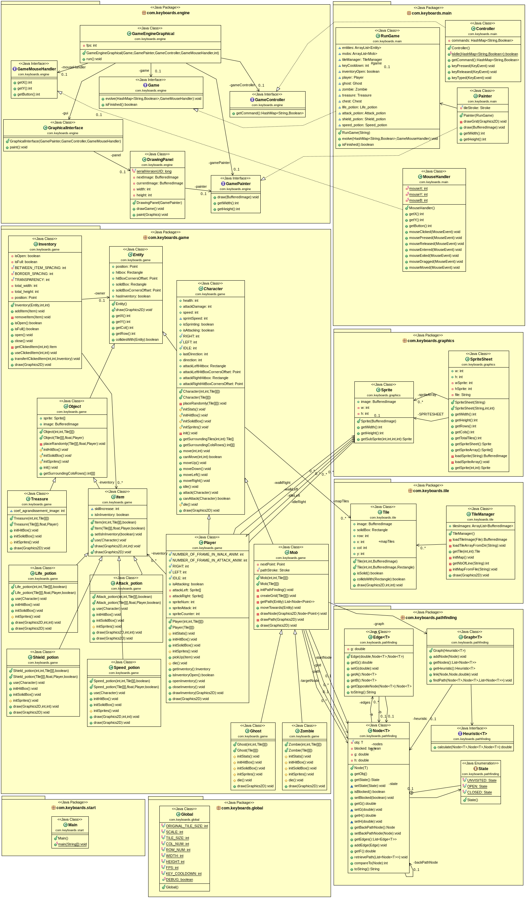
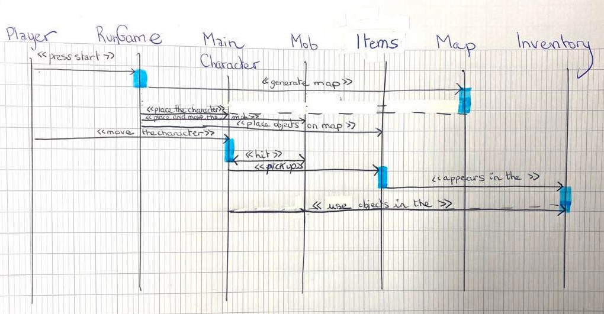
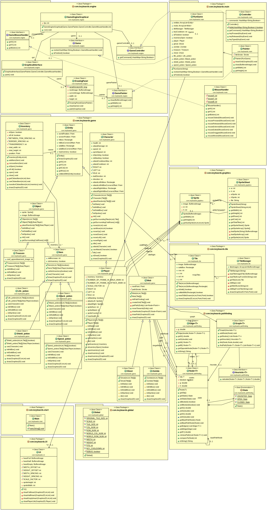

# Backlog 2 début

**Fonctionnalités pour le sprint 2 :**

- Placement objets (trésor, vie) et effets des objets
- Personnage qui attaque le monstre
- UI vie personnage
- Déplacement de la caméra avec le personnage
- Faire fichier map plus grand
- Gestion souris
- Inventaire

**Qui fait quoi :**

- Robin : Inventaire + gestion souris
- Elsa : UI vie personnage + déplacement de la caméra avec le personnage
- Antoine : Placement objets (trésor, vie) et effets des objets
- Audrey : Faire fichier map plus grand
- Loric : Personnage qui attaque le monstre

## Diagramme de classes

## Diagramme de sequence

&nbsp;
# Backlog 2 fin

## Sprint review

**Fonctionnalitées réellement réalisées pour le sprint 1:**

- Fonctionnalitées réalisées réellement et validées pour le sprint 2
- Placement objets (trésor, vie) et effets des objets
- Personnage qui attaque le monstre
- Afficher la vie du personnage
- Map de 50x50
- Inventaire

## Sprint rétrospective

**Ce qu'il s'est passé :**

- Manque de temps pour finir le déplacement de la caméra avec le personnage
- La régularité des réunions (tous les 2 jours) a permi un meilleure communication entre les membres de l’équipe et cela a permi une meilleure compréhension des tâches de chacun et une résolution rapide des problèmes rencontrés.
- L’apprentissage de la gestion des conflits a été difficile.

**Decisions prises pour le sprint 3 :**

- Continuer la régularité des réunions.
- Privilégier les réunions en présentiel plutôt qu’en distanciel.

## Diagramme de classes final

