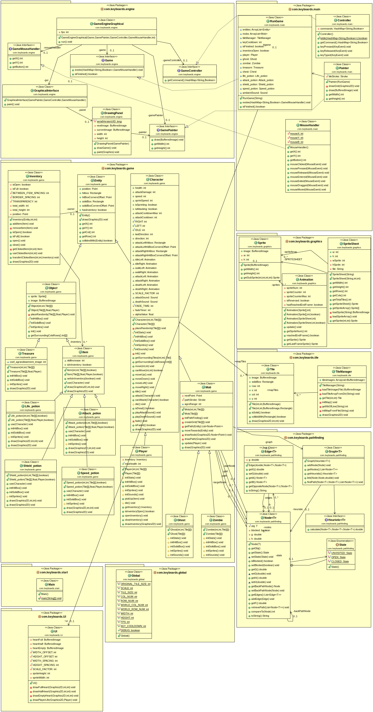
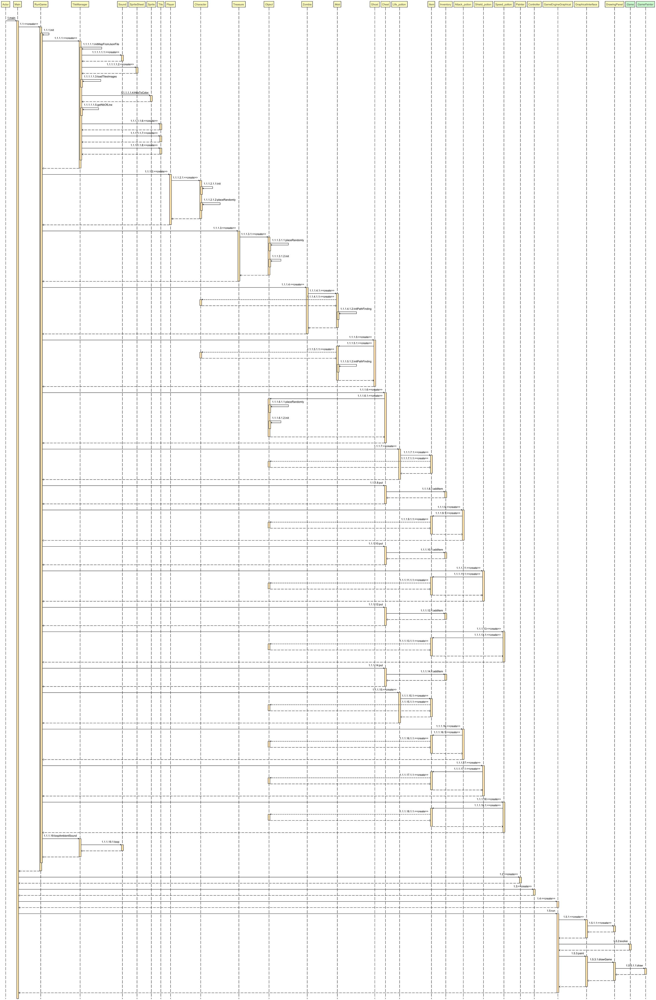

# Backlog 4 début

**Fonctionnalités pour le sprint 4 :**

- Caméra qui suit le joueur
- Changement de map une fois trésor trouvé
- Enlever collision fantôme
- Cases pièges et cases téléportations si obligatoire
- Faire test Junit

**Qui fait quoi :**

- Robin : Caméra
- Elsa : Changement de map
- Loric : test Junit base déplacement
- Audrey : test Junit dégats
- Antoine : Cases spécial

## Diagramme de classes

## Diagramme de séquence

**Fonctionalitée launch :**

**Fonctionalitée evolve :**

&nbsp;
## Backlog 4 fin

## Sprint review

**Fonctionnalitées réellement réalisées pour le sprint 4:**

- Caméra qui suit le joueur
- Changement de map une fois trésor trouvé
- Enlever collision fantôme
- Faire test Junit
- ajout d'un écran de début et d'un écran de fin 

## Sprint rétrospective

**Ce qu'il s'est passé :**

- Nous nous sommes concentrés sur les fonctionnalités obligatoires et nécéssaires pour terminer le jeu.
- Nous avons réparti les tâches mais nous nous sommes entraidés afin que tout soit terminé à temps.
- Les vacances nous ont permis d'avoir des horaires de réunions plus flexibles, ce qui a simplifié l'organisation.

## Diagramme de classes final

## Diagramme de séquence final

**Fonctionalitée launch :**

**Fonctionalitée evolve :**

